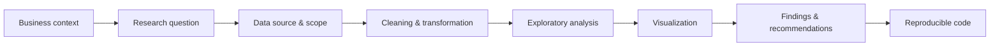

  

  
  
  
  

---

## 👋 About me

Computer Engineer with **6+ years** in international corporate and technology-driven environments. My background covers digital workflows, process validation, technical problem-solving, and collaboration with multidisciplinary teams.

I'm expanding into **data analytics and visualization** through a Cisco learning program supported by my employer. The goal: combine engineering judgment, software development, operational experience, and data-driven methods to turn information into clear insights and practical solutions.

---

## 🧭 Professional focus

<table>
  <tr>
    <td width="33%" valign="top">
      <h3>📊 Data Analytics</h3>
      Collection, cleaning, and transformation 
      Exploratory analysis 
      Dashboards and visualization 
      Trends, patterns, and improvement opportunities 
      Findings translated into business recommendations
    </td>
    <td width="33%" valign="top">
      <h3>💻 Software Development</h3>
      Web applications 
      APIs and system integration 
      Automation and local-first tools 
      Tools that support analysis 
      Git-based workflows
    </td>
    <td width="33%" valign="top">
      <h3>🔐 Cybersecurity</h3>
      Threats and vulnerabilities 
      Data protection and network security 
      Identity and access management 
      Risk and secure development 
      Responsible data handling
    </td>
  </tr>
</table>

---

## 🛠️ Toolkit

**Data & Analytics**

&nbsp;SQL · Tableau · Exploratory Data Analysis · Data Storytelling

**Software Development**

**Security & Environment**

---

## 🚀 Portfolio projects

Each project is documented as a complete case study: problem, data, method, findings, and limitations.

<table>
  <tr>
    <td width="33%" valign="top">
      <h3>🔎 Technology Job Market Analysis</h3>
        
      Analysis of data, software development, and cybersecurity job opportunities: requested skills, work arrangements, locations, experience requirements, and salary information when available.  
      <b>Stack:</b> SQL · Tableau · Python 
      <b>Shows:</b> data collection, cleaning, EDA, visualization, communication of findings  
      <a href="#">Case study →</a>
    </td>
    <td width="33%" valign="top">
      <h3>🛡️ Security+ Learning Analytics</h3>
        
      System to examine practice results, recurring mistakes, objective coverage, and progress, in order to generate more focused study recommendations.  
      <b>Stack:</b> TypeScript · Python 
      <b>Shows:</b> data modeling, progress metrics, analytical logic, responsible handling of learning data  
      <a href="#">Case study →</a>
    </td>
    <td width="33%" valign="top">
      <h3>⚙️ Digital Workflow Performance Analysis</h3>
        
      Analysis of anonymized or simulated operational data to evaluate processing times, recurring errors, workload patterns, and process improvement opportunities.  
      <b>Stack:</b> SQL · Tableau · Excel 
      <b>Shows:</b> KPI definition, trend analysis, dashboards, actionable recommendations  
      <a href="#">Case study →</a>
    </td>
  </tr>
</table>

---

## 🧪 How I document projects

<b>Repository standards</b>

 

- A clearly defined problem and analytical objective
- Documented and ethically sourced data
- Reproducible preparation and analysis steps
- Relevant visualizations rather than decorative charts
- Findings connected to the original question
- Limitations, assumptions, and future improvements
- No confidential, proprietary, or personally identifiable information

---

## 🏢 Background

My experience in regulated and technology-oriented environments has built my attention to detail, adaptability, process awareness, and consistency with quality standards. It gives me practical context on how data supports operational efficiency, quality, risk management, and continuous improvement.

Beyond my corporate work, I have experience in software development and technology education: web applications, programming, electronics, robotics, and digital systems.

---

## 🎯 Direction

I'm building toward roles where I can combine Computer Engineering, software development, corporate knowledge, and growing analytics skills to support better decisions, improve processes, automate workflows, and deliver reliable technical solutions. Cybersecurity stays part of that path, so I approach data, applications, and systems with a solid understanding of protection and risk.

---

## 📊 GitHub activity

  
  

---

## 📫 Let's connect

  
  

